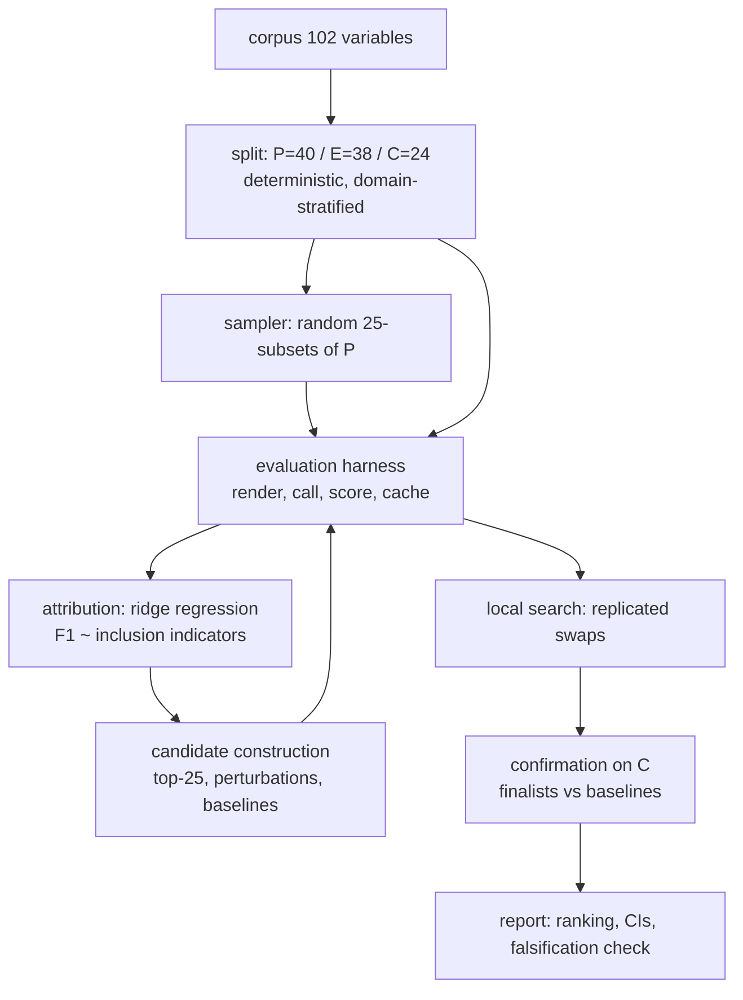

# Example-selection optimization (exploratory side analysis)

**This is not part of the official experiment.** Its own runner, own output directory, own
evaluation split. Nothing it produces can enter an official ranking, campaign or results
table. For the official experiment see [campaign log](../../docs/campaign-log.md).

Sibling of [shot-count-ablation.md](../shot-count-ablation.md), which established the shot-count
curve this work sits on top of.

## Goal

Of the 102 corpus variables, which 25 make the best few-shot prompt for `Qwen3.8-27B`?

The search space is C(102,25) ~ 1e24, so exhaustive evaluation is impossible and the question
is really "which search strategy finds a good set within a realistic budget, and how would we
know it is actually good?"

## Decisions

Round 1 of the interview was put to the user, who delegated the decisions back
("do not need to wait for me ... run the tests based on the best optimisation algorithm you
can find"). They are recorded here with their reasoning so a later reader can tell what was
chosen deliberately from what was assumed.

### DS-1 — Evaluation uses a fixed three-way split, not `eval = 102 - S`

The original framing scored each candidate set `S` on the 77 variables it did not use. That
lets the candidate choose its own denominator, and the effect is not small. Measured on real
per-variable scores at 25 shots (median 0.40, SD 0.32, 13 variables scoring zero):

| 25 variables moved out of the eval set | Micro Close F1 | vs 72-variable baseline 0.4672 |
|---|---:|---:|
| 25 random | 0.4686 | +0.0014 |
| **25 hardest** | **0.6348** | **+0.1676** |
| 25 easiest | 0.2508 | -0.2165 |

An optimizer maximising F1 gains **+0.17 for putting the hardest variables in the prompt**,
whether or not they teach the model anything. That dwarfs the entire few-shot effect under
study (0.23 across the whole 0->25 curve) and the ~0.02 differences we can actually resolve.
The optimizer would converge on "the 25 hardest variables" and report a spurious 0.63.

So the corpus is partitioned once, deterministically and stratified by domain:

| Split | Size | Role |
|---|---:|---|
| `P` — candidate pool | 40 | the 25 are chosen from here |
| `E` — search evaluation | 38 | fixed; scores every candidate during the search |
| `C` — confirmation | 24 | held out entirely until the final comparison |

Every candidate is scored on the identical `E`, so the denominator cannot move. Search space
becomes C(40,25) ~ 6.8e10 — still far beyond enumeration, so this remains a real optimization
problem, but a well-posed one.

**Rejected:** keeping `eval = 102 - S` (fatal, above); difficulty-normalised scoring on the
same framing (needs its own baseline campaign and only partly closes the leak).

### DS-2 — `C` exists because selection overfitting here is severe, not hypothetical

Picking the argmax of a noisy objective biases the winner upward by roughly
`SD * sqrt(2 ln K)` for `K` candidates examined. At the measured noise and `K ~ 600` that is
about +0.09 — larger than any true effect we expect to find. A winner's score measured on the
set that selected it is therefore not evidence. `C` is touched exactly once, at the end, and
the headline claim rests on it.

### DS-3 — Objective is micro Close F1 with official-style invalid handling

Invalid predictions are scored as an explicit empty prediction and the variable stays in the
population, matching the official pipeline. The alternative used by the earlier side
experiments — dropping invalid predictions from the aggregate — opens a second denominator
leak: the optimizer could gain by inducing unparseable output on hard variables. Both rules
are recorded per candidate; only the official-style one is optimised.

### DS-4 — Search is randomized-subset attribution, then local refinement

This decision follows from the measured noise floor, which is the binding constraint.

Ten repetitions at each of 20/25/30 shots gave a within-level SD of **0.019** on 38 variables
(scaling to ~0.0265 on `E`). A single evaluation of one candidate therefore resolves
differences of only ~0.07. **Any algorithm that ranks individual candidates against each other
— greedy forward selection, hill-climbing, evolutionary search — spends its whole budget
chasing noise**, because the true differences between candidate sets are almost certainly
smaller than that.

The strategy that works under this noise is to stop comparing candidates and start pooling
across them:

1. **Attribution.** Sample ~600 random 25-subsets of `P`, score each once on `E`, then ridge-
   regress observed F1 on the 40-dimensional binary inclusion vector. Each example appears in
   ~62.5% of subsets, so every coefficient is estimated from ~375 observations and the noise
   averages down by ~sqrt(n) instead of being fought head-on. The coefficients are per-example
   marginal contributions — a linear Shapley-value estimate.
2. **Construction.** Build candidates from the ranking: top-25 by coefficient, plus
   perturbations, plus the baselines below.
3. **Refinement.** Swap-based local search over the constructed candidates, replicated so each
   comparison is made at a noise level that can actually support it.
4. **Confirmation.** Finalists and baselines re-evaluated on `C` with repetitions.

Because `|S|` is fixed at 25, the inclusion columns sum to a constant and are collinear with
the intercept; columns are centred and ridge regularisation applied so coefficients are
identified.

**Known limitation:** the model estimates main effects only. Interactions between examples
certainly exist, but C(40,2)=780 interaction terms cannot be estimated within budget. This
buys a good set, not a provably optimal one.

**Rejected:** greedy forward selection (25 rounds x ~40 candidates x replication exceeds
budget, and each individual comparison is below the noise floor); evolutionary search (same
problem, plus no interpretable output); Bayesian optimization over a 1e10 combinatorial space
(surrogate would be fit on far too few points).

### DS-5 — Baselines are part of the deliverable

"Best 25" means nothing without something to beat. Every finalist is compared on `C` against:
random 25 (many draws), domain-stratified 25, the 25-prefix of the existing 30-variable pool,
an embedding-diversity selection computed from the local `all-MiniLM-L6-v2` at zero API cost,
and the bottom-25 by attribution coefficient as a falsification check — if the bottom-25 does
not score clearly worse, the attribution model has learned nothing.

### DS-7 — The bottom-25 control is attenuated, so falsification has two arms

Caught in Phase 4 by the test written against the `design` contract: with a 40-member pool and
25-member candidates, the top-25 and bottom-25 by coefficient **must** share
`2*25 - 40 = 10` members. The contract had claimed they would be disjoint, which is false by
arithmetic.

Enlarging the pool to 50 would make them disjoint, but only by taking 10 variables out of `E`
and `C` — raising the search-evaluation SD from ~0.0265 to ~0.0285 and the confirmation SD from
~0.032 to ~0.036. Noise is the binding constraint in this experiment, so paying for a cleaner
control with a noisier measurement is the wrong trade.

The pool stays at 40, the bottom-25 control is kept but recorded as **attenuated** (15 of 25
members differ, so a true effect appears reduced), and the random-25 reference distribution is
promoted to an equal falsification arm. The winner must beat both.

### DS-6 — Scope and isolation

`Qwen3.8-27B` on PSNC, matrix-decomposition, T=0.5, top_p 1.0, 16,000 max output tokens,
reasoning disabled, 25 shots. One model keeps the entire budget on one objective. Concurrency
24, the validated PSNC ceiling.

Isolation is identical to the other side experiments: lives in `few-shot-selection/`, which no
artifact collector walks; writes no campaign, run, task or evaluation row; reads nothing from
`parameters.yml`; writes only `few-shot-selection/example_selection/output/`. Results carry no
campaign identity and
cannot enter an official ranking. No entry is added to the root `DECISIONS.md`, following the
precedent set by the shot-count ablation — the official decision index stays uncontaminated.

## Module breakdown

| Contract | Logical modules it covers | Responsibility |
|---|---|---|
| [`design`](contracts/design.md) | split, sampler, construct | Every *set of variables* the experiment uses: the P/E/C partition, the random subsets, the finalists and the baselines. Pure and deterministic, no provider access. |
| [`harness`](contracts/harness.md) | harness | Scores one candidate against one evaluation set — render, call, validate, aggregate under both rules — and owns the call cache that makes everything resumable. |
| [`attribution`](contracts/attribution.md) | attribution | Ridge-regresses subset scores on inclusion indicators to estimate each example's marginal contribution, and reports whether that estimate has stabilised. |
| [`pipeline`](contracts/pipeline.md) | refine, confirm, report | Orders the four stages, enforces the budget, protects the held-out set from ever informing selection, and writes the report. |

The eight logical modules in the diagram above collapse onto these four contract seams; a
module is a boundary, not a file.

## Delivery order

1. `split` + `sampler` — pure, no API calls, verifiable offline.
2. `harness` with its cache and resume — the expensive path, proven on a small limit first.
3. Attribution stage (~600 subsets).
4. `construct` + `refine`.
5. `confirm` on `C`, which is not touched before this point.
6. `report`.

## Out of scope

Multi-model optimization; interaction effects; optimizing shot count jointly with membership
(fixed at 25 by the question); example *ordering* within the prompt; any change to the official
machinery.

## Docs reconciled

**Docs last reconciled:** 2026-09-14 at commit `e341649`, with the rename working-tree changes
present. Scope: this side experiment's plan, its four contracts, and its implementation.

Corrected directly (factual): `contracts/pipeline.md` section 10 omitted `planned_calls`
entirely, gave `stage_construct` and `stage_refine` signatures without their `reps` parameter,
and gave `stage_confirm` a `baselines` parameter that does not exist — baselines are passed as
entries of `finalists`, which is what guarantees they get the identical protocol (INV-5).

Corrected in the 2026-09-14 pass (factual), alongside the rename of `experiments/` to
`few-shot-selection/`: this README's isolation claim said the experiment writes only
`few-shot-selection/output/`, which is the *sibling* runners' directory — every write from this
experiment goes to `few-shot-selection/example_selection/output/`, as `run.py` already stated
correctly. The claim had named the wrong directory since before the rename. Also repaired the
`campaign-log.md` link in `../shot-count-ablation.md`, which resolved as a sibling while that
document lived in `docs/` and does not now.

Checked and found correct, so deliberately left alone: OQ-1's RESOLVED note. `_check_budget`
does take `search_reps`/`confirm_reps`, `run.py` does thread the invoked values through, and
`test_budget_gate_costs_the_requested_repetitions` does refuse `--reps 200`. The preserved
original finding text proposes calling the gate "at the head of every stage"; only stage A calls
it, but `_check_budget` prices the whole plan through `planned_calls`, and INV-4 stops any later
stage running while stage A is incomplete, so INV-7 holds. That text is archival by design.

## Known performance limitation

Candidates are evaluated one at a time, and one candidate is only `len(E)` = 38 calls against a
concurrency of 24. The second wave therefore runs 14 wide and the batch blocks on its slowest
call, giving roughly `mean + p90` = 3.1 + 4.6 = 7.7s per candidate, or ~5 calls/s against the
~7.7 calls/s the endpoint sustains. Measured over 6,400 calls: PSNC latency is flat (3.1s mean,
4.6s p90) and failures are zero, so this is a scheduling limit in `pipeline`, not a provider
limit.

Pipelining several candidates concurrently would close the gap and cut a full run by about
25%. Deliberately not done during the first run: it changes no scored value, only scheduling,
so it is a pure optimisation and not worth destabilising a healthy resumable run for.

## Open questions

**OQ-1 (RESOLVED 2026-09-12) — the budget gate was structurally blind to the caller's
repetition counts.** Fixed: `_check_budget` now takes `search_reps` and `confirm_reps` as
parameters and `run.py` passes the values it was invoked with; regression test
`test_budget_gate_costs_the_requested_repetitions` asserts that `--reps 200` is refused. The
original finding is kept below because the record of the defect is worth more than its absence.

`pipeline._check_budget` computes the plan with the hardcoded `DEFAULT_SEARCH_REPS` and
`DEFAULT_CONFIRM_REPS` rather than the values actually passed, while `run.py` exposes `--reps`
and `--confirm-reps`. `run.py --reps 200 --confirm-reps 200` passes a gate that checked 28,380
calls and then dispatches 188,400 — 1.6x the declared ceiling, undetected. Contract INV-7 says
the pipeline refuses to exceed the ceiling; the code cannot see the plan it is about to run.
The contract is right and the implementation is incomplete: the fix is to thread the real
`reps` and `confirm_reps` into `_check_budget` and call it at the head of every stage, not only
stage A. Not fixed here — `docs-drift` repairs records, never code. Affects `pipeline`; does
not affect the run currently executing, which uses the defaults the gate assumes.

None blocking. The budget is adaptive: the attribution stage is resumable and its sample count
can be extended if the coefficients have not stabilised, which the report checks by split-half
correlation of the fitted coefficients.
